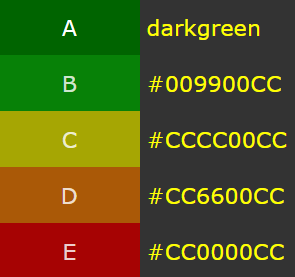

# test_CL_CH

Vous devez créer une page web qui affiche une liste des céréales du petit-déjeuner. 
Les informations proviennent d'une API fictive et sont disponibles dans le fichier `data.json`.

La collection de céréales contient les informations suivantes :

ID | Name | Calories | Protéïnes | Sel | Fibres | Glucides | Sucre | Potassium | Vitamines | Évaluation

1. Lister les céréales dans des cartes avec: le nom en gras, la catégorie et une jauge indiquant le nutri-score. Les cartes doivent être côtes à côtes et responsive. Càd que lorsque la fenêtre se réduit, les cartes sautent à la ligne suivante.

2. Ajouter un bouton dans les cartes permettant de supprimer celle-ci

3. Ajouter un filtre pour catégoriser les céréales par nutriscore. Si tous les céréales d'un nutriscore sont supprimés, celle-ci ne doit plus appraître.

Le nutri-score d'un céréale (de A à E) est calculé selon l'évaluation :

- A: Plus de 80%
- B: Entre 70% et 80%
- C: Entre 55% et 70%
- D: Entre 35% et 55%
- E: Moins de 35%

Couleurs nutri-score : 

Prennez des initiatives, il y a des points bonus si

* C'est joli
* Il y a une attention aux détails